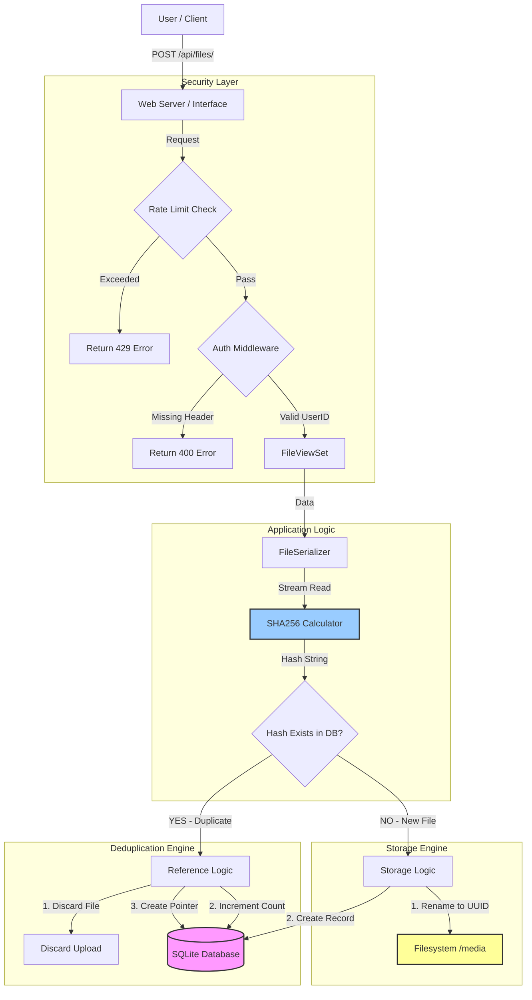
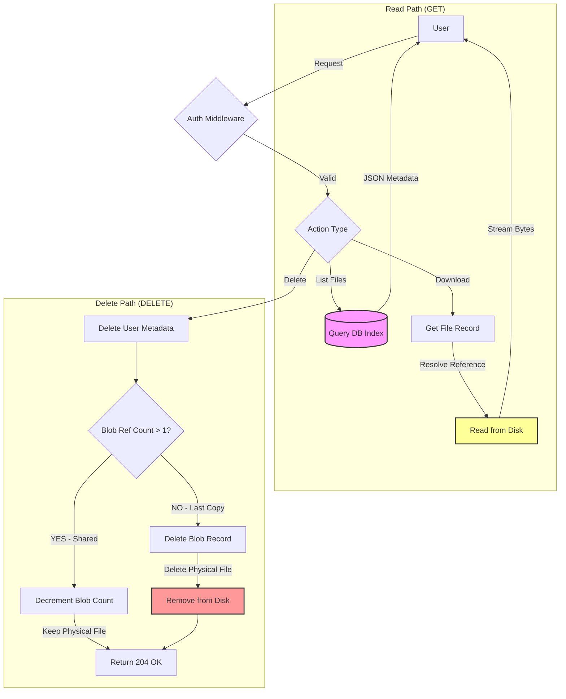

# Project Architecture & Code Guide

This document provides a comprehensive breakdown of the **Abnormal File Vault** project. It explains the reasoning behind every major design choice and maps each feature directly to the source code.

## 📋 Implemented Features Overview

The following production-grade features have been implemented in this project:

1. **Secure File Storage:** UUID-based renaming to prevent path traversal and collisions.
2. **Smart Deduplication:** SHA-256 content addressing to save storage space (Single Instance Storage).
3. **Storage Quotas:** Strict 10MB limit per user to prevent abuse.
4. **Rate Limiting:** Protection against DDoS/spam (2 requests/second).
5. **User Isolation:** Strict privacy where users can only access their own files.
6. **Advanced Search:** Filtering by size, type, and date using Database Indexes.
7. **Dockerized Infrastructure:** Fully containerized environment.

---

## 📚 Table of Contents

1. [Core File Management](#1-core-file-management)
2. [Storage Optimization (Deduplication)](#2-storage-optimization-the-smart-features)
3. [Security & Reliability](#3-security--reliability)
4. [Data Access (Search & Indexing)](#4-data-access)
5. [System Architecture Diagrams](#5-system-architecture-diagrams)
6. [Infrastructure](#6-infrastructure)

---

## 1. Core File Management

### Feature: Secure File Upload & Storage

**What it does:** Allows users to upload files while ensuring the server's filesystem remains secure.

**Implementation:**

- **UUID Filenames:** When a file is uploaded, it is renamed using a UUID (Universally Unique Identifier).
- **Extension Preservation:** The original file extension is kept (e.g., `.pdf`) so the OS knows how to handle it, but the filename itself is discarded on disk.

**📍 Code Location:**

- **Renaming Logic:** `backend/files/models.py` -> Look for the `file_upload_path` function.
- **Validation:** `backend/files/validators.py` -> `validate_file_size` (10MB limit) and `validate_file_type`.
- *Note:* This validation happens **server-side** after the file has been received by Django (into memory or a temporary file), but **before** it is permanently saved to the `media/` directory or the database.

**Why this design?**

- **Security (Path Traversal):** If a user uploads a file named `../../etc/passwd`, saving it directly could overwrite critical system files. Renaming to a UUID neutralizes this threat.
- **Collision Avoidance:** If two users upload `resume.pdf`, a naive system would overwrite the first one. UUIDs ensure every file on disk has a unique path.

### Feature: Comprehensive Metadata

**What it does:** Stores details about the file (Original Name, Size, MIME Type, Upload Date) separately from the physical file.

**Implementation:**

- The `File` model acts as a metadata layer.
- The physical file is just a blob on the disk; the database holds the "truth" about what that file is.

**📍 Code Location:**

- **Database Models:** `backend/files/models.py` -> `class File` and `class FileBlob`.
- **Deletion Logic:** `backend/files/models.py` -> `File.delete()` method.
- *Crucial Logic:* The system uses **Reference Counting** on the `FileBlob`.
- **Deleting a File (User Action):** When a user deletes a file, their `File` record (metadata) is deleted immediately.
- **Blob Cleanup (System Action):**
    - The system decrements the `reference_count` on the associated `FileBlob`.
    - **If Count > 0:** The `FileBlob` (physical file) remains on disk because other users are still referencing it.
    - **If Count == 0:** The `FileBlob` is deleted from the database, and the physical file is removed from the disk to reclaim space.

**Why this design?**

- **Normalization (CAS):** We separated "Metadata" (`File`) from "Data" (`FileBlob`). This is known as Content-Addressable Storage.
- **Efficiency:** We don't need to track "Originals" vs "References". Every file is just a pointer to a blob. If 100 users upload the same file, we have 100 `File` records but only 1 `FileBlob`.
- **Concurrency:** This avoids the complex "Anchor" problem where deleting an "Original" required finding a new owner. Now, the Blob itself is the anchor, and it stays until the last user leaves.
- **Searchability:** Metadata (filenames, dates) is kept in the lightweight `File` table, making searches fast.

---

## 2. Storage Optimization (The "Smart" Features)

### Feature: Content-Addressable Deduplication

**What it does:** If multiple users upload the exact same file, the system stores only **one** physical copy on the disk (`FileBlob`) but creates separate metadata records (`File`) for each user.

**Implementation:**

- **Hashing:** Upon upload, the system calculates the SHA256 hash of the file content.
- **Blob Lookup:**
    - The system checks if a `FileBlob` with this hash already exists.
    - **If Yes:** It links the new `File` record to the existing `FileBlob` and increments its `reference_count`. No new data is written to disk.
    - **If No:** It creates a new `FileBlob`, saves the physical file, and links the new `File` record to it.

**📍 Code Location:**

- **Hashing & Check:** `backend/files/serializers.py` -> `FileSerializer.create()` method.
- *Logic:* Calculates hash, looks up `FileBlob`, and either links or creates.
- **Hash Field:** `backend/files/models.py` -> `FileBlob.file_hash`.

**👀 Visualizing the Database Records:**

We use a **Normalized Schema** with two tables:

* **Table 1: `FileBlob` (The Physical Data)**
    * `id`: UUID-1
    * `file_hash`: "a1b2c3d4..." (SHA256)
    * `file`: `/media/uploads/uuid.pdf`
    * `reference_count`: 2

* **Table 2: `File` (The User Metadata)**
    * **Row 1 (User A):**
        * `id`: 101
        * `user_id`: "User A"
        * `original_filename`: "MyResume.pdf"
        * `blob_id`: UUID-1 (Points to the blob above)
    * **Row 2 (User B):**
        * `id`: 102
        * `user_id`: "User B"
        * `original_filename`: "Candidate_CV.pdf"
        * `blob_id`: UUID-1 (Points to the *same* blob)

**Result:** Two users see two different filenames, but only **one** file exists on disk.

**Scenario: What if User A deletes their file?**

1. User A sends `DELETE /api/files/101`.
2. The system deletes Row 1 from the `File` table immediately. User A no longer sees the file.
3. The system decrements the `reference_count` on the `FileBlob` (UUID-1) from 2 to 1.
4. **Result:** The `FileBlob` remains on disk because User B is still using it.

**Scenario: What if User B then deletes their file?**

1. User B sends `DELETE /api/files/102`.
2. The system deletes Row 2 from the `File` table.
3. The system decrements the `reference_count` on the `FileBlob` from 1 to 0.
4. **Result:** Since the count is now 0, the system deletes the `FileBlob` record and removes the physical file from the disk.

---

**Why this design?**

- **Storage Efficiency:** In enterprise environments, users often share the same documents (policy PDFs, logos, installers). Deduplication can reduce storage costs by 30-50%.
- **Performance:** "Uploading" a duplicate is instant because no disk I/O is required for writing the file.

### 💡 Interview Discussion: Server-Side vs. Client-Side Deduplication

You asked: *"Does the user still have to upload the file?"*

**The Answer:** Yes.

* **How it works here (Server-Side):**
    1. User uploads the full 10MB file (Bandwidth is used).
    2. Server receives it in a temporary folder.
    3. Server calculates Hash (Very fast, ~0.01s).
    4. Server checks DB. If duplicate found -> Delete temp file, create reference.
    * *Why:* It is **Secure**. We don't trust the client to send a correct hash.

* **The Alternative (Client-Side / "Dropbox Style"):**
    1. Browser calculates hash using JavaScript.
    2. Browser sends *only* the hash to API.
    3. API says "I have it!" -> Browser skips upload.
    * *Trade-off:* Saves bandwidth, but requires complex frontend logic and trust verification.

### 💡 Design Decision: Normalized Architecture (CAS)

We chose to implement the **Normalized Architecture** (splitting `File` and `FileBlob`) rather than the simpler "Fat Model" approach.

**Why we chose this:**

1.  **Clean Separation of Concerns:**
    *   `FileBlob` handles *storage* (hashing, physical paths, size).
    *   `File` handles *ownership* (filenames, upload dates, user permissions).

2.  **Scalability:**
    *   If 1,000 users upload the same 10MB PDF, we store 10MB of data, not 10GB.
    *   Metadata operations (renaming, moving) are fast and don't touch the physical storage.

3.  **No "Ghost Records":**
    *   In a non-normalized system, if User A deletes a shared file, we have to keep a "Zombie" record for User B.
    *   In our system, User A's record is truly deleted. User B's record remains untouched. The system handles the cleanup automatically when the last user leaves.

**Trade-off:**
*   **Complexity:** It requires slightly more complex logic during creation (checking for existing blobs) and deletion (reference counting). However, the long-term benefits for data integrity and storage efficiency outweigh this initial cost.

---

## 3. Security & Reliability

### Feature: User Storage Quotas

**What it does:** Limits each user to **10MB of TOTAL storage space**.

* *Note:* There is also a **10MB limit per single file**.
* *Result:* A user can upload one 10MB file, OR two 5MB files, OR ten 1MB files. Once their bucket is full, they cannot upload more.

**Implementation:**

- **Separate Model:** A `UserStorageQuota` model tracks usage per `user_id`.
- **O(1) Checks:** Instead of summing up all file sizes every time a user uploads (which gets slower as they upload more files), we maintain a running total (`total_storage_used`).

**📍 Code Location:**

- **Data Structure:** `backend/files/models.py` -> `class UserStorageQuota`.
- **Logic:** `backend/files/serializers.py` -> `FileSerializer.create` (atomic check & update for uploads) and `backend/files/views.py` -> `destroy` (calls `update_storage_usage` for deletes).

**Why this design?**

- **Performance:** Calculating `Sum(size)` on the fly is an O(N) operation. Reading a single integer from a Quota table is O(1). This ensures the system remains fast even with millions of files.
- **Fairness:** Prevents a single user from filling up the entire server disk.

### 🚧 To Do / Future Improvements

* **Data Migration for Quota Updates:** Currently, changing the `USER_STORAGE_QUOTA` constant only affects *new* users.
    * *Task:* Create a Django Data Migration script to update `storage_limit` for existing users if the global policy changes.
    * *Why:* Without this, early adopters would stay on the old limit (e.g., 10MB) even if we raise the limit to 1GB.

### Feature: Rate Limiting

**What it does:** Restricts users to 2 requests per second.

**Implementation:**

- **Decorator Pattern:** A `@rate_limit` decorator wraps API views.
- **Cache-Based:** Uses Django's cache framework (defaulting to Local Memory, but swappable for Redis) to count requests. It uses a "Fixed Window" or "Token Bucket" approach keyed by `user_id`.

**📍 Code Location:**

- **Decorator Definition:** `backend/files/decorators/rate_limit.py`.
- **Application:** `backend/files/views.py` -> Look for `@rate_limit_method()` decorator on individual methods in `FileViewSet`.

**Why this design?**

- **DDoS Protection:** Prevents malicious actors from overwhelming the server with thousands of requests.
- **Resource Management:** Ensures the server remains responsive for all users, rather than being hogged by one script.

### Feature: User Isolation (Authentication)

**What it does:** Ensures User A can only see and manage User A's files.

**Implementation:**

- **Middleware:** Intercepts every request and extracts the `UserId` header.
- **Queryset Filtering:** Automatically filters all database queries with `.filter(user_id=request.user_id)`.

**📍 Code Location:**

- **Middleware:** `backend/files/middleware/authentication.py` -> `UserIdAuthenticationMiddleware`.
- **Enforcement:** `backend/files/views.py` -> `FileViewSet.get_queryset()` method.

**Why this design?**

- **Privacy:** Fundamental requirement. Users must not see each other's data.
- **Simplicity:** Using a header is easier to implement and test than a full OAuth flow for this specific challenge.

---

## 4. Data Access

### Feature: Advanced Search & Filtering

**What it does:** Allows users to find files by name, type, size, or date.

**Implementation:**

- **Django Filter Backend:** Uses `django-filters` to map URL query parameters (e.g., `?min_size=1000`) directly to database queries.
- **Indexing:** The database columns `file_type`, `user_id`, and `uploaded_at` are indexed.

**📍 Code Location:**

- **Configuration:** `backend/files/views.py` -> `FileViewSet` attributes (`filter_backends`, `search_fields`).
- **Indexes:** `backend/files/models.py` -> `Meta.indexes`.

**Why this design?**

- **Performance:** Database indexes make searching instant. Without indexes, the database has to scan every single row (Full Table Scan), which is slow.

---

## 5. System Architecture Diagrams

### 5.1 Upload Flow (Write Path)

Here is the visual flow of how a file upload travels through the system, from the user to the disk.

### 5.2 Download & Delete Flow (Read/Destroy Path)

Here is how the system handles retrieving and removing files, specifically the "Reference Counting" logic.

---

## 6. Infrastructure

### Feature: Docker Containerization

**What it does:** Packages the application, database, and dependencies into a single unit.

**Implementation:**

- `Dockerfile`: Defines the OS (Python 3.9), dependencies, and startup commands.
- `docker-compose.yml`: Orchestrates the services (Web, Database) and handles networking and volumes.

**📍 Code Location:**

- **Configuration:** `docker-compose.yml` (Root) and `backend/Dockerfile`.

**Why this design?**

- **Reproducibility:** "It works on my machine" is solved. The environment is identical for every developer and the production server.
